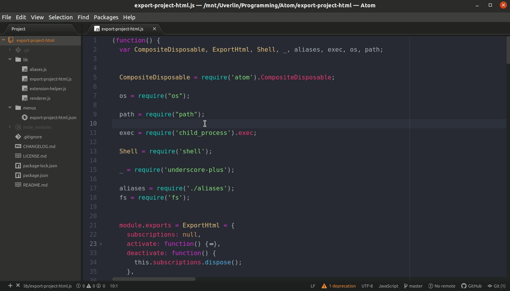

# export-project-html (Atom Package)

A plugin for the [Atom text editor](https://atom.io/) that exports the currently open code project to a static website, in a new folder called _WebPublish_ in the project's root directroy. All code files are exported to html so that when opened in a browser the code is formatted like it would be in Atom, and markdown files are rendered into rich text too.  
This plugin is based on the [export-html package by nubohito](https://atom.io/packages/export-html) (for converting code files to html) and Atom's built-in [markdown-preview](https://github.com/atom/markdown-preview) package for converting markdown files to html, many thanks to the developers of those packages.

## Usage:
In Atom, press `Ctrl+Shift+P` and then search for "export-project-html" ("xpro" will do). Then press enter, and your project will be converted to html in a folder called _WebPublish_.


## Issues:
When using fenced or tabbed codeblocks without a specified language, the plugin crashes. This is a [known issue in the markdown-preview package](https://github.com/atom/markdown-preview/issues/552), whose code is used in this package.

A workaround is to specify a language for the code block:

For example, in your markdown, don't do:
```markdown
    Hello world example:
    ```
    import os
    print("Hello World!")
    ```
```
Instead:
```markdown
    Hello world example:
    ```python
    import os
    print("Hello World!")
    ```
```
Don't do:
```markdown
Hello world example:
    import os
    print("Hello World!")
```
Instead:
```markdown
Hello world example:
    ```python
    import os
    print("Hello World!")
    ```
```

